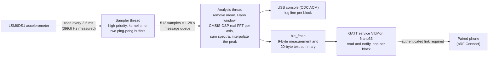
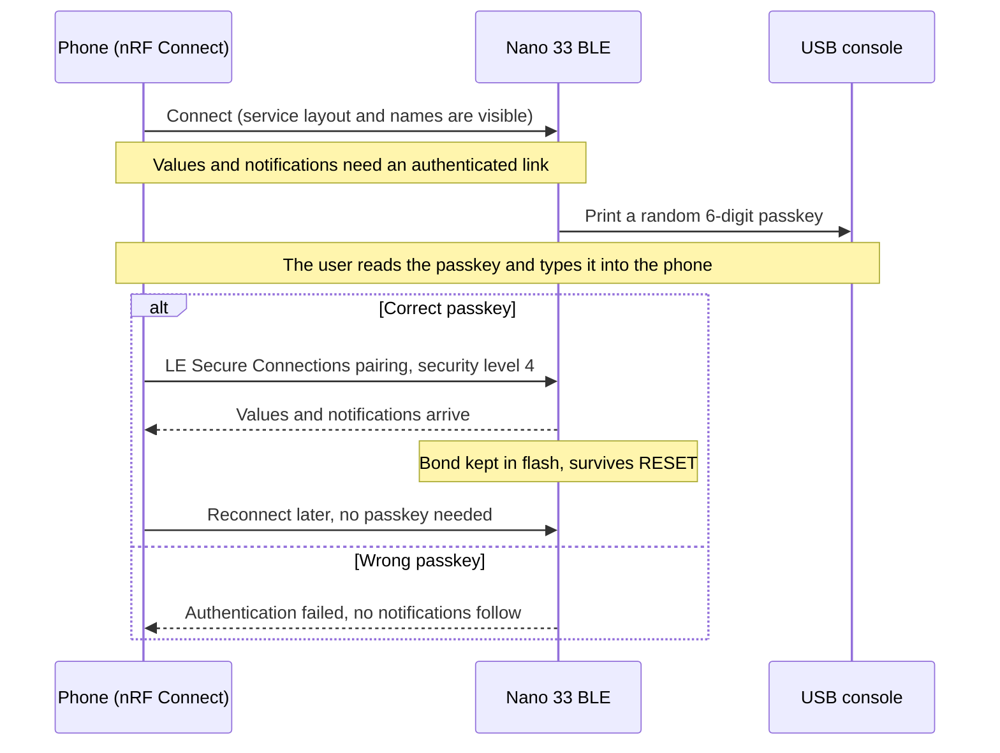

# Zephyr BLE Vibration Monitor

[](https://github.com/baliyu/zephyr-ble-vibration-monitor/actions/workflows/ci.yml)

Vibration monitor on the **Arduino Nano 33 BLE** (nRF52840, LSM9DS1 motion sensor) built on **Zephyr RTOS 4.4.2**: sensor sampling, CMSIS-DSP FFT, a secure BLE GATT service, unit tests that run on the PC, and CI.

**Status: finished.** All ten planned steps are done and verified; the optional ideas that remain are listed under Known limitations.

## Progress
- [x] Step 1 – Identified the motion sensor from the chip itself: LSM9DS1 (accel/gyro 0x6B, WHO_AM_I `0x68`; magnetometer 0x1E), so the original Nano 33 BLE, not the Rev2
- [x] Step 2 – Zephyr 4.4.2 workspace and SDK 1.0.1 installed; blinky builds for `arduino_nano_33_ble/nrf52840`
- [x] Step 3 – Flashing from WSL through Arduino's `bossac`: found and fixed a doubled flash offset (see Lessons learned); a diagnostic blinky on the green power LED proved Zephyr runs
- [x] Step 4 – Application skeleton: console over USB (CDC ACM, appears as a COM port), red-LED heartbeat, uptime log once a second
- [x] Step 5 – LSM9DS1 accelerometer through Zephyr's sensor API, with a start-up report (I2C probe of both sensor chips, supply state, driver start). Flat: |a| = 9.57 m/s^2; tilted: 9.80 (see Lessons learned)
- [x] Step 6 – Dominant vibration frequency with a CMSIS-DSP FFT: 400 Hz sampling thread with ping-pong buffers, 512-point Hann-windowed FFT per axis, summed spectra, interpolated peak. On hardware: still / hand shaking at 2.3-3.5 Hz; FFT 2.8 ms per 1.28 s block; 0 missed ticks, read errors or dropped blocks
- [x] Step 7 – BLE GATT service: the board advertises as `VibMon Nano33` with a custom service of two read + notify characteristics (a 9-byte binary measurement and a short text summary), one notification per 1.28 s block. Verified with nRF Connect on an iPhone: the values on the phone match the USB console
- [x] Step 8a – Secure pairing: the values can only be read or subscribed to over an authenticated LE Secure Connections link. The board has no display, so a random 6-digit passkey is printed on the USB console and typed into the phone. On hardware: pairing reaches security level 4, reconnecting needs no passkey, a wrong passkey is refused
- [x] Step 8b – Bonds in flash and a console command to forget them: a paired phone stays paired across RESET; typing `U` then `y` on the console deletes all bonds (and the deletion also survives RESET)
- [x] Step 9 – Zephyr ztest unit tests for the four board-independent modules (`accel_stats`, `vib_fft`, `ble_fmt`, `ble_cmd`): 44 test cases that run on the PC as a normal program on `native_sim`, with the same CMSIS-DSP the firmware uses. The plain `make` tests in `tests/host` stay as a quick local check
- [x] Step 10 – GitHub Actions CI: on every push and pull request, one job runs the unit tests on `native_sim` and another builds the firmware for the Nano 33 BLE with the pinned Zephyr 4.4.2 and SDK 1.0.1. The badge above shows the latest result

## Layout
```
CMakeLists.txt, prj.conf       application build and Kconfig
boards/arduino_nano_33_ble_nrf52840.overlay   console over USB instead of the header UART
src/main.c                     sampler thread + analysis thread, USB console output
src/vib_fft.c                  dominant frequency, amplitude and rms (CMSIS-DSP real FFT)
src/accel_stats.c              integer statistics (step 5)
src/ble_fmt.c                  byte layout of the two characteristics (pure C, tested on the PC)
src/ble_vib.c                  the GATT service, advertising, notifications (Zephyr Bluetooth)
src/ble_sec.c                  pairing policy: passkey display, pairing events, forget command thread
src/ble_cmd.c                  the U-then-y console command as a pure state machine (tested on the PC)
tests/host/                    PC tests: make -C tests/host (uses Zephyr's own CMSIS-DSP)
tests/unit/                    ztest suites on native_sim (Zephyr test app, see "Unit tests")
.github/workflows/ci.yml       the CI workflow (two jobs, see "Continuous integration")
tools/ci_setup.sh              pinned Zephyr workspace and SDK setup used by CI (and runnable by hand)
tools/flash_nano33ble.sh       guarded flashing from WSL (bossac.exe on Windows)
tools/flash_map.py             locate an image in a flash dump (diagnostic)
diagnostics/blinky_power_led.overlay   blinky on the green power LED, to prove the image runs
```
Zephyr itself lives outside the repository (`~/zephyrproject`, pinned to v4.4.2).

## How the analysis works

<!-- diagram:zephyr_flow -->
**Data flow, from sensor to phone**



*The dotted line means the values only reach a phone over an authenticated link (see BLE security).*

- **Sampling:** a high-priority thread reads the accelerometer every 2.5 ms from a kernel timer into one of two buffers. When 512 samples (1.28 s) are collected it hands the buffer to the analysis thread through a message queue and carries on in the other buffer. It records the real sample rate, missed timer ticks, read errors and the slowest read.
- **Analysis:** per axis, the mean (gravity) is removed and a Hann window applied before a CMSIS-DSP real FFT; the three power spectra are summed so the result does not depend on orientation. The peak is refined by Gaussian (log-parabolic) interpolation and the amplitude corrected for the window's scalloping loss. Below 0.05 m/s^2 rms the board counts as still; below 2 Hz is ignored (tilting).
- **Measured rate, not nominal:** a 2.5 ms timer on a 32768 Hz system clock really gives 399.6 Hz; the frequency calculation uses the measured rate (a test shows assuming 400 Hz would put 50 Hz at 50.05 Hz).
- **PC tests:** 17 tests for the FFT module, built against the exact CMSIS-DSP revision Zephyr 4.4.2 pins: worst frequency error 0.013 Hz over a 3-190 Hz sweep on all axes (bin width 0.78 Hz), worst amplitude error 0.7%, two-tone, diagonal, noise-only, buried-in-noise, slow-tilt and bad-input cases; also run under the address and undefined-behaviour sanitizers.

## BLE service
The board advertises as **`VibMon Nano33`** with one custom service. The UUIDs are randomly chosen 128-bit values.

| Item | UUID | Properties | Content |
|---|---|---|---|
| Service | `5f2e0001-6d1b-4a3c-9b2e-7c4d1a2b3c4d` | | |
| Measurement | `5f2e0002-6d1b-4a3c-9b2e-7c4d1a2b3c4d` | read, notify | 9 bytes, little-endian |
| Summary | `5f2e0003-6d1b-4a3c-9b2e-7c4d1a2b3c4d` | read, notify | UTF-8 text, at most 20 bytes |

**Measurement bytes:** `flags` (bit 0 = vibrating), `frequency` in 0.1 Hz, `amplitude` and `rms` in milli-m/s^2 (each a 16-bit value), and a 16-bit block sequence number. Frequency and amplitude are 0 when the board is still. Example from a real capture: `01 54 00 6D 21 E9 18 D0 00` is vibrating, 0x0054 = 8.4 Hz, amplitude 0x216D = 8.557 m/s^2, rms 0x18E9 = 6.377 m/s^2, block 208; the USB console printed the same 8.4 Hz / 8.557 / 6.377 for that block.

**Summary text:** for example `24.6Hz 0.51 0.37` (frequency, amplitude, rms) or `still rms 0.025`. It is kept to 20 bytes so it fits one notification at the default ATT MTU.

One notification per analysed block (every 1.28 s) goes to a phone that has subscribed. After a disconnection the board starts advertising again by itself. The byte layout lives in `src/ble_fmt.c`, which has no Zephyr code in it and 10 PC tests (exact bytes and byte order, rounding, clamping of absurd values, NaN and negatives, the 20-byte worst case).

**Try it with nRF Connect (iPhone):** Scanner tab, connect to `VibMon Nano33`, open the service starting `5F2E0001`, and subscribe to a characteristic (the far-right button on its row). The first time, the phone asks for a passkey (next section). The service layout, names and labels are visible before pairing; the values are not.

## BLE security
**Goal:** only a phone that has been paired with a passkey can read or subscribe to the vibration data. Anyone nearby can still see the device, connect to it and discover the service.

<!-- diagram:zephyr_pairing -->
**Pairing flow**



*Checked on the board with an iPhone: pairing at security level 4, reconnecting without a passkey, and a wrong passkey being refused. Not checked: that an unpaired phone is refused a direct read (see "Not verified" below).*

**How it works**
- The characteristic values and their notification (CCC) descriptors require an *authenticated* link (`BT_GATT_PERM_READ_AUTHEN` / `WRITE_AUTHEN`). The text labels stay public because they carry no data.
- The Nano 33 BLE has no display or keyboard, so "Just Works" pairing would be encrypted but not authenticated: anyone could pair. Instead the board **prints a random 6-digit passkey on the USB console** and the phone user types it in. Whoever can see the console can pair; if nobody has it open, pairing fails. An unexpected passkey appearing on the console is also a visible warning that someone else tried to pair.
- `CONFIG_BT_SMP_SC_ONLY=y` (Secure Connections Only mode): the stack accepts only authenticated LE Secure Connections pairing at security level 4 and rejects Just Works pairing (checked in Zephyr's `smp.c`), so an unauthenticated bond cannot exist. MITM protection is enforced.
- **Policy as a build check:** `ble_sec.c` fails the build if `CONFIG_BT_SMP_SC_ONLY` or `CONFIG_BT_SETTINGS` is missing from `prj.conf`, or if `CONFIG_BT_FIXED_PASSKEY` (a fixed, public passkey) is enabled.
- **Bonds are kept in flash** (Zephyr settings on NVS, in the board's free 32 KB `storage_partition` at 0xF8000), so a paired phone stays paired across RESET. Up to two phones can be paired; a third that also knows the passkey replaces the oldest.
- **Forgetting the bonds:** the only button is RESET, so the USB console is the management interface. In a terminal on the board's COM port type **`U`**, then **`y`** within 5 seconds: all paired phones are deleted from RAM and flash and any connected phone is disconnected. Any other key, or 5 seconds of silence, cancels. The key logic (`src/ble_cmd.c`) is a small state machine with 16 PC tests: a lone `y` does nothing, a late `y` is refused, Enter is ignored, the millisecond counter may wrap. Also use *Settings > Bluetooth > (i) > Forget This Device* on the iPhone; if only the board forgets, iOS reports that the peer removed its pairing information until the phone forgets the device too.

**Verified on the Nano 33 BLE + iPhone (nRF Connect):** pairing with the passkey reaches security level 4; the values then arrive and match the console; disconnecting and reconnecting needs no passkey; a wrong passkey fails with `authentication failed` and no notifications follow; after RESET the board reports `1 paired phone(s) restored from flash` and the phone reconnects without a passkey; the forget command prints `BLE bond deleted ...`, and after RESET the board reports `0 paired phone(s)`. Sampling stayed at 0 missed / 0 errors / 0 dropped throughout, including while keys were written to and deleted from flash.

**Not verified:** that an *unpaired* phone is refused a read directly (it follows from the permissions, but I never watched it happen); an Android phone; two phones paired at once; whether reflashing keeps or erases the bonds. The pairing code itself cannot run on the PC (the passkey comes from the Zephyr Bluetooth stack), so it was compiled against stand-in headers and then proven on the board.

## Unit tests
Two sets of PC tests cover the same four modules (`accel_stats`, `vib_fft`, `ble_fmt`, `ble_cmd`), which contain no board code:
- **`tests/host/`**: plain C with a Makefile, no Zephyr build needed apart from its CMSIS-DSP source. `make -C tests/host`.
- **`tests/unit/`**: Zephyr **ztest** suites, 44 test cases in five suites, built for **`native_sim`** so the code runs as an ordinary PC program with Zephyr's own CMSIS-DSP. This is what continuous integration runs.

```bash
source ~/zephyrproject/.venv/bin/activate && cd ~/zephyrproject/zephyr
west build -p always -b native_sim/native/64 /mnt/c/zephyr-ble-vibration-monitor/tests/unit -d ~/build/unit
~/build/unit/zephyr/zephyr.exe          # ends with PROJECT EXECUTION SUCCESSFUL
```
The `/64` variant needs no 32-bit libraries. The same suites run under Twister: `west twister -T tests/unit -p native_sim/native/64`.

**Design notes**
- The FFT is checked on real signals: single tones on each axis, a 3-190 Hz sweep, two tones, a diagonal vibration, noise-only, a tone buried in noise, slow tilting, and the measured 399.6 Hz sample rate.
- Noise comes from a small deterministic generator, so results do not depend on the C library's `rand()`.
- "Refuses to run before init" can only be observed once per process. It is its own suite, `vib_fft_1_before_init`, which Zephyr runs before `vib_fft_2_analysis` because it sorts suites by name.
- A test that cannot fail proves nothing. As a check, the confirm window in `ble_cmd.c` was changed by one millisecond; exactly the two tests about the window failed, and the source was restored.

## Continuous integration
`.github/workflows/ci.yml` runs on every push to `main`, on pull requests and on demand. Two jobs, both on Ubuntu 24.04:

| Job | What it does |
|---|---|
| **Unit tests (native_sim)** | Builds the ztest suites for `native_sim` with the host compiler, runs them, then runs the plain C tests in `tests/host`. A failing check fails the job. |
| **Firmware build (Nano 33 BLE)** | Builds the real firmware for `arduino_nano_33_ble/nrf52840` with the Zephyr SDK's ARM toolchain, prints the flash and RAM use in the job summary, and keeps `zephyr.bin`, `zephyr.hex` and `zephyr.elf` as a downloadable artifact. |

**Pinned and minimal.** Zephyr v4.4.2 and SDK 1.0.1 (whose download is checked against a SHA-256) are fixed in `tools/ci_setup.sh`, and only the seven Zephyr modules this project actually needs are fetched: CMSIS, CMSIS 6, CMSIS-DSP, the Nordic and ST HALs, mbedTLS and TF-PSA-Crypto. The workspace and SDK are cached between runs.

**Reproduce it locally** (Ubuntu or WSL2), for example in a scratch folder:
```bash
CI_ROOT=$PWD bash tools/ci_setup.sh workspace      # Zephyr + modules, about 1 GB
CI_ROOT=$PWD bash tools/ci_setup.sh sdk            # ARM toolchain, about 2 GB
cd zephyrproject/zephyr
ZEPHYR_SDK_INSTALL_DIR=$OLDPWD/zephyr-sdk-1.0.1 west build -p always \
    -b arduino_nano_33_ble/nrf52840 /path/to/this/repo -d ../../build/firmware
```
For the current code the firmware uses 279,868 bytes of flash (29.45 % of 928 KB) and 69,638 bytes of RAM (26.56 % of 256 KB), with no compiler warnings.

**What CI does not do:** it only compiles the firmware and runs the PC tests. Bluetooth pairing, the sensor and everything else that needs the board and a phone are checked by hand on the hardware (see "BLE security").

## Security analysis
A STRIDE threat model is in [docs/THREAT_MODEL.md](docs/THREAT_MODEL.md): the attackers, assets and trust boundaries, 15 threats, the evidence behind each mitigation and the residual risk. It is my own design-level analysis, not an independent review. The three things I would fix first for a product: there is no secure boot or signed firmware (the Arduino bootloader accepts any image), a stranger can occupy the board's single BLE connection because unauthenticated links never time out, and the pairing keys are stored unencrypted in flash. A gap analysis against the 22 essential requirements of the EU Cyber Resilience Act (a self-assessment of how the project would measure up if it were a product) is in [docs/CRA_MAPPING.md](docs/CRA_MAPPING.md), and how to report a vulnerability is in [SECURITY.md](SECURITY.md).

## Known limitations
- **Aliasing above 200 Hz.** At 400 Hz sampling, vibrations above 200 Hz appear mirrored below it (250 Hz would read about 150 Hz). The sensor runs at 952 Hz with its own filter at a few hundred Hz, which does not fully prevent this. The fix is to read the sensor's internal FIFO at its full rate, which Zephyr's LSM9DS1 driver does not support yet.
- **Sample timing.** Polling a sensor that samples on its own clock gives up to about 1 ms uncertainty in when each value was taken: fine for finding a dominant frequency, not for precise phase or amplitude work.
- **No calibration.** The Z axis reads about 2.5 % low on this board (see below).
- **Whoever has the USB port is trusted.** The passkey appears on the console and the forget command is typed there, so physical access to the board is the trust anchor. A person with the console open sees the passkey of any pairing attempt, including a stranger's.
- **The pairing keys are stored unencrypted in flash.** Reading the flash (for example with a debug probe) would expose them. There is no flash encryption or readout protection on this board setup.
- **Not private.** The device name, fixed address and service UUID are advertised in the clear, and an unpaired phone can connect and discover the service structure (not the values).
- **The confirm key.** On hardware the forget command confirmed with a lowercase `y`; a capital `Y` did not work once and I did not find out why, although the parser accepts both (PC test) and the USB driver passes keys through. Treat `y` as the documented key.
- **Flash writes pause the CPU briefly.** The 400 Hz sampling showed no missed ticks while keys were stored and deleted, but this was observed on a few occasions, not stress-tested.

## Build and flash (Ubuntu/WSL2)
```bash
source ~/zephyrproject/.venv/bin/activate && cd ~/zephyrproject/zephyr
west build -p always -b arduino_nano_33_ble/nrf52840 /mnt/c/zephyr-ble-vibration-monitor -d ~/build/vib
# double-tap RESET on the board, then find its COM port:
powershell.exe -NoProfile -c "[System.IO.Ports.SerialPort]::GetPortNames()"
sh /mnt/c/zephyr-ble-vibration-monitor/tools/flash_nano33ble.sh COM7
```
After flashing, the application's own USB serial port appears (a different COM port from the bootloader's); open it at 115200 baud. The program waits up to 30 seconds for a terminal before printing. The PC tests run with `make -C tests/host`.

The flash script makes the same call as the Arduino IDE (no `--offset`, see below), refuses an image larger than the code partition, refuses to flash unless the port answers as an nRF52840 with the Arduino bootloader, and stops unless bossac exits cleanly and prints `Verify successful`.

## Lessons learned
- Read the chip, not the label: the sensor's WHO_AM_I register decided the board variant.
- In Zephyr, `led0` is whatever the board file says: on this board it is the red channel of the RGB LED, not the yellow "L" LED, which shares its pin with SPI.
- **A verified flash is not a running program.** Zephyr's bossac runner passes `-o 0x10000`, but Arduino's build of bossac (1.9.1-arduino2) already writes at the bootloader's application address, 0x10000: Arduino's own core links sketches at 0x10000 and uploads them with no offset. The offset was applied twice, the image landed at 0x20000, and the bootloader kept starting the old Arduino sketch at 0x10000 (green power LED steady, no Zephyr output). The bootloader refused flash reads, so the cause was found from Arduino's linker script and upload command, then confirmed with a blinky on the green power LED. The same problem is reported in Zephyr issues #33523 and #33352.
- Testing the flash script against a fake bossac caught two bugs before they reached hardware: piping bossac's output hid its exit status, so a failed flash would have printed "Done."
- **Defaults can switch things off.** The LSM9DS1 devicetree binding defaults the output data rate to the power-up value, which is "IMU off": without setting `imu-odr` the accelerometer reads zeros.
- **A driver that fails at boot fails silently.** Started automatically, the sensor driver reported "not ready" with its error printed before any terminal could see it. Marking the node `zephyr,deferred-init` and starting it from `main()` with `device_init()`, after a direct I2C probe of both chips' WHO_AM_I registers, made it start reliably and turned the failure into a readable report.
- **Logging over the console it depends on.** Immediate-mode logging with the console on USB made the USB stack log through the USB link it was still setting up; the board hung before enumerating. Zephyr guards only the CDC ACM class against this loop (the build warns "USBD_CDC_ACM_LOG_LEVEL forced to LOG_LEVEL_NONE"). Logging was removed; the start-up report uses plain prints.
- **Per-axis error shows up as orientation dependence.** Flat, |a| read 9.57 m/s^2; tilted so gravity fell on X and Y, 9.80. Same code, different axis: the Z axis reads about 2.5 % low on this sensor, a calibration matter, not a code fault.
- **Faster sensor, more noise.** Raising the sensor rate from 119 to 952 Hz widened its internal filter and raised the still-board noise from about 0.008 to 0.025 m/s^2 rms; the "still" threshold (0.05) still separates it.
- **Stub compiles catch real bugs.** Compiling `main.c` against minimal stand-in Zephyr headers on the PC caught a `printk` format mismatch (`int64_t` is not `long long` on every platform) before the first real build.
- **Encrypted is not authenticated.** "Just Works" pairing encrypts the link but anyone can pair, so a device without a display or keyboard needs another channel for the passkey. Here the USB console is that channel, and Secure Connections Only mode makes the stack refuse the unauthenticated fallback instead of trusting every central to behave.
- **Check the stack, not memory.** Every pairing API and Kconfig name was checked against the Zephyr v4.4.2 source, which also showed what `bt_unpair` really does (disconnects the phone, deletes the keys and the stored notification state) and that the USB console driver discards output rather than blocking when no terminal is open.
- **Make the policy fail the build.** A security setting that lives only in `prj.conf` can be dropped by accident; `BUILD_ASSERT`s in `ble_sec.c` turn that into a compile error (checked by compiling with the setting removed).
- **Separate logic from the stack to test it.** The Bluetooth parts cannot run on the PC, so the byte formats (`ble_fmt.c`) and the unpair key sequence (`ble_cmd.c`) are plain C with their own PC tests; only the thin Zephyr glue is proven on the board.
- **Find the minimal dependency set by building.** The first firmware build in a clean workspace failed twice, each time naming what was missing: Bluetooth security needs the mbedTLS crypto modules, and the LSM9DS1 driver needs the ST HAL. Fetching only what the build asks for keeps CI fast.
- **A CI setup you cannot run is a guess.** The workflow's commands live in `tools/ci_setup.sh`, and the whole sequence was replayed from an empty directory before the first push. That also exposed that GitHub's API is rate-limited without a token, so the SDK is fetched from fixed release URLs instead.
- **A suite is only as good as its checks.** The ztest port was compared check by check with the older PC tests; two slips (a wrong expected value and different input numbers in one rounding test) were found that way before the first run.
- **Hardware surprises are still possible after tests pass.** The key parser passed every PC test, yet on the board a capital `Y` was not accepted once while `y` was. It is listed as a limitation rather than hidden.
